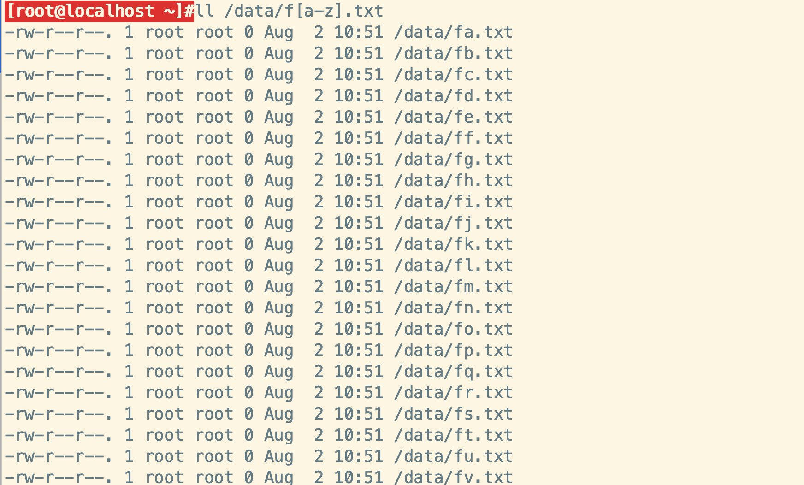

# Linux文件类型

> 作者:张大鹏
>
> 时间:2019年8月2日
>
> 抖音:lxgzhw
>
> 微博:理想国真恵玩
>
> 博客:http://lxgzhw520.com
>
> GitHub: https://github.com/lxgzhw520


```
- 普通文件
d 目录文件
b 块设备
c 字符设备
l 符号链接文件
p 管道文件pipe
s 套接字文件
```


## 001.文件路径

- 绝对路径:从根路径开始的都是绝对路径
  - 以`/`开头的就是绝对路径
- 相对路径:不是从根路径开始的都是相对路径
  - 两个点`..`表示上一级目录
  - 一个点`.`表示当前目录
  - 直接写当前文件夹下的文件夹名字,表示当前目录
  - `../../`表示上级目录的上级目录,以此类推


## 002.文件通配符

`*` 匹配0个或多个字符

`?`匹配任意单个字符

`~`当前用户的家目录

`~lxg`用户lxg的家目录

`~+`当前工作目录

`~-`前一个工作目录

`[0-9]`匹配数字范围

`[a-z]`小写字母

`[A-Z]`大写字母

`[abcd]`匹配其中任意一个字符

`[^abc]`匹配除了列表中的字符

- 查看f开头,匹配a-z中间任意字符,以.txt结尾的任意文件




## 003.标准输入和输出

- stdin 标准输入 0 
- stdout 标准输出 1
- stderr 标准错误 2